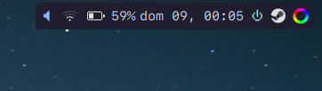

An implementation of the freedesktop [StatusNotifierItem][0] specification (the
successor of appindicators and systray) for polybar.

This allows you to use many existing status indicators, e.g. for NetworkManager
or Steam. Menus are supported via rofi.




## Dependencies

-   python3-gi
-   rofi (or a similar dmenu-like tool)

## Configuration

-   In host.py, adapt `render()` to use your icons and colors
-   In menu.py, adapt `DMENU_CMD` to your preferred dmenu-like tool

Apart from that, feel free to change whatever you like. This repo is meant as
an example, not a turn-key solution.

## Module

```ini
[module/indicators]
type = custom/script
exec = python3 -u ~/polybar-status-indicators/host.py
tail = true
```

[0]: https://www.freedesktop.org/wiki/Specifications/StatusNotifierItem/
